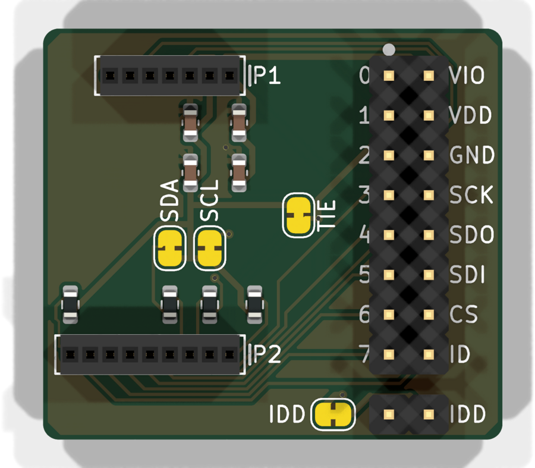
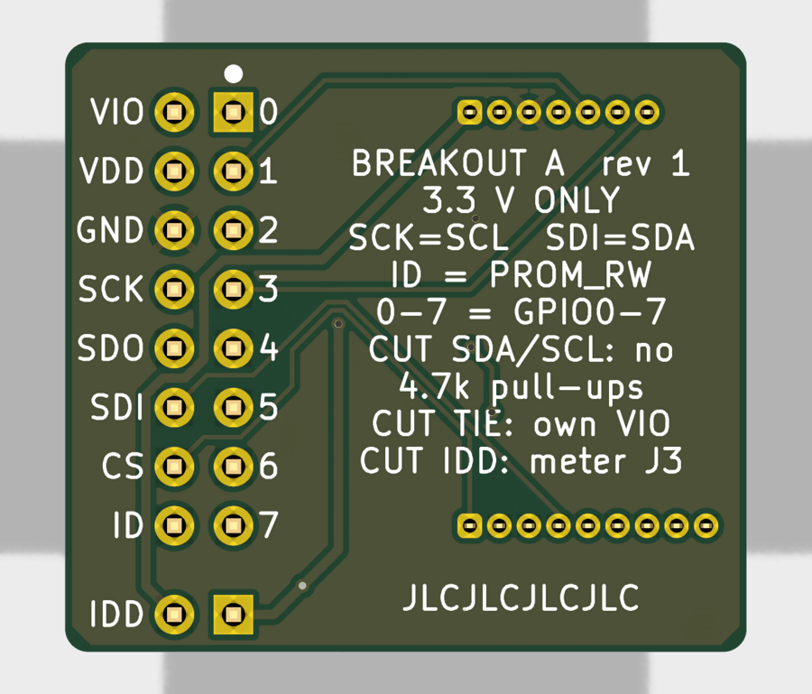

# Board A: Shuttle 3.0 breakout

A 29.3 x 26.2 mm board that takes **any Bosch Sensortec Shuttle Board 3.0**,
including the BME690 8x shuttle, and brings all 16 of its pins out to a
labelled 2.54 mm header for Dupont wires, a breadboard ribbon or a
microcontroller.

 

## What's on it

| part | job |
|---|---|
| J1 | shuttle sockets: P1 (7 pins) and P2 (9 pins), 1.27 mm. A 7-pin and a 9-pin socket, so the shuttle only fits one way |
| J2 | 2x8 2.54 mm header with every shuttle pin |
| J3 | 2 pins for measuring the sensor's VDD current (IDD) |
| R1, R2 | 4.7k I2C pull-ups on SDA and SCL, each behind a cut jumper |
| R3 | 1k pull-up on PROM_RW, the shuttle's ID chip |
| R4 | 10k pull-up on CS, so single-sensor shuttles start in I2C mode |
| C1-C4 | 100 nF + 10 uF on VDD, and the same on VDDIO |

**3.3 V only. Never connect 5 V.**

## Header pin map (J2)

The column next to the shuttle carries its GPIO0-7, and the outer column
carries power and the bus. Both sides of the board are labelled, and a dot
marks pin 1.

| row | inner pin | inner label | signal | outer pin | outer label | signal |
|---|---|---|---|---|---|---|
| 1 | 1 | 0 | GPIO0 (P1-4) | 2 | VIO | VDDIO (P1-2) |
| 2 | 3 | 1 | GPIO1 (P1-5) | 4 | VDD | VDD supply in |
| 3 | 5 | 2 | GPIO2/INT1 (P1-6) | 6 | GND | GND (P1-3) |
| 4 | 7 | 3 | GPIO3/INT2 (P1-7) | 8 | SCK | SCK/SCL (P2-2) |
| 5 | 9 | 4 | GPIO4 (P2-5) | 10 | SDO | SDO (P2-3) |
| 6 | 11 | 5 | GPIO5 (P2-6) | 12 | SDI | SDI/SDA (P2-4) |
| 7 | 13 | 6 | GPIO6 (P2-7) | 14 | CS | CS (P2-1) |
| 8 | 15 | 7 | GPIO7 (P2-8) | 16 | ID | PROM_RW (P2-9) |

On the **BME690 8x shuttle**, GPIO0-7 are the chip selects of sensors
U1-U8, and CS (P2-1) isn't connected to anything. The 8x shuttle only works
over SPI: in I2C mode all eight sensors would answer at the same address.

## Solder jumpers

All four are **closed as made**. To open one, cut the thin trace between
its pads with a sharp knife. To close it again, bridge the pads with solder.

| jumper | label | open it to |
|---|---|---|
| JP1 | IDD (bottom left of J3) | measure sensor current: put a meter across J3 |
| JP2 | TIE | power VDDIO separately from VDD (feed VIO yourself) |
| JP3 | SDA | remove the 4.7k SDA pull-up |
| JP4 | SCL | remove the 4.7k SCL pull-up |

With TIE closed, one 3.3 V wire to **VIO** or **VDD** powers everything.

## Which side for the header?

The header is hand-soldered, so you choose:

- **Pins down, on the back:** best for sniffing jars. The sensors face the
  sample and the wires leave from the other side, so the plastic and wire
  insulation stay out of the air being measured.
- **Pins up, on the front:** easiest on a bench.
- **Right-angle header:** the wires leave sideways and the board lies flat.
  Its body covers the labels on that side, but the other side is labelled
  too.

**To a breadboard:** use a 16-way ribbon cable with a 2x8 IDC socket on
one end and a 16-pin DIP IDC plug on the other. Put the red stripe at the
pin-1 dot. The plug sits across the breadboard's centre gap. Its pins
alternate between the two DIP rows, so check the plug's datasheet for which
conductor lands where. A flat ribbon also passes a jar lid's seal far
better than loose jumpers.

## Assembly

JLCPCB fits the eight 0603 parts. You solder the through-hole parts.

1. Check the board under a light: all eight SMD parts present, no bridges.
2. **Sockets first.** Plug both sockets onto the shuttle and push the
   shuttle into the board. The shuttle holds the sockets straight and at
   the right spacing. Solder one end pin of each row, check they sit flat,
   then solder the rest. Remove the shuttle before it gets hot for long.
3. **2x8 header** on the side you chose. Solder one pin, check it's square,
   then the rest.
4. **J3** (optional), the same way.
5. Check with a meter: 3V3 to GND must **not** be a short. VIO to VDD
   reads about 0 ohm (TIE closed).

## Smoke test (ESP32-S3)

`smoke_test/smoke_test.ino` (Arduino IDE or arduino-cli, ESP32 core 3.x,
board "ESP32S3 Dev Module"). The wiring matches the logger firmware's pin
map, so a board wired for the logger runs the test unchanged.

| Board A | ESP32-S3 |
|---|---|
| VIO | 3V3 |
| GND | GND |
| SCK | GPIO12 |
| SDI | GPIO11 |
| SDO | GPIO13 |
| 0-7 | GPIO1, 2, 4, 5, 6, 7, 15, 16 |

- `MODE_SPI 1` (the default), for the 8x shuttle: reads the chip ID
  register of all eight sensors and expects **0x61** from each. A sensor
  that answers wrong names its chip-select wire.
- `MODE_SPI 0`, for a single-sensor shuttle: scans I2C and reads register
  0xD0 at **0x76**. It drives SDO low to set that address, because SDO
  must not float. Expect 0x61. Leave CS open; the 10k pull-up selects I2C.

For the full logger, see `firmware/bme690-logger-idf`.

**PROM_RW (shuttle ID):** the DS28E05 talks at 1-Wire **overdrive speed
only** (up to 76.9 kbps). The datasheet's overdrive timings are:

| timing | value |
|---|---|
| reset low | 48-80 us |
| presence sample | 8-10 us |
| write-0 low | 8-16 us |
| write-1 / read low | 1-2 us |
| sample by | 2 us |
| slot | 13 us minimum |
| EEPROM write | 16 ms per write |

Common ESP32 1-Wire libraries run at standard speed and won't see it. A
reader needs these timings, using the RMT peripheral or interrupt-free bit
timing. It isn't in the smoke test yet.

## Ordering at JLCPCB

All files are in `fab/`:

| file | upload as |
|---|---|
| `board_a-gerbers.zip` | the PCB (Gerbers + Excellon drill) |
| `board_a-bom-jlcpcb.csv` | PCB Assembly: BOM |
| `board_a-cpl-jlcpcb.csv` | PCB Assembly: CPL / pick-and-place |
| `board_a-bom-full.csv` | your shopping list, including the hand-soldered parts |
| `board_a-schematic.pdf`, `board_a-layout.pdf` | for checking |

**Board options:**

| option | setting |
|---|---|
| layers | 2 |
| thickness | 1.6 mm |
| material | FR-4 |
| solder mask | green |
| surface finish | **LeadFree HASL** |
| Mark on PCB | **Remove Mark** (free, and the default) |
| quantity | 5 |

**Assembly options:**

| option | setting |
|---|---|
| type | Economic |
| side | Top |
| boards to assemble | 5 (or 2, the minimum) |

### Parts JLCPCB fits

All are LCSC **Basic** parts, so there is no extended-part fee. Stock was
checked 2026-10-05.

| parts | value | LCSC | stock |
|---|---|---|---|
| R1, R2 | 4.7k 1% 0603 | C23162 | 22.2 M |
| R3 | 1k 1% 0603 | C21190 | 21.3 M |
| R4 | 10k 1% 0603 | C25804 | 29.6 M |
| C1, C3 | 100 nF X7R 50 V 0603 | C14663 | 57.2 M |
| C2, C4 | 10 uF X5R 10 V 0603 | C19702 | 10.3 M |

### Parts you buy and solder

Per board:

| part | qty | about |
|---|---|---|
| Sullins LPPB071NFFN-RC, 7-pin 1.27 mm socket | 1 | $1.00 |
| Sullins LPPB091NFFN-RC, 9-pin 1.27 mm socket | 1 | $1.20 |
| 2x8 male header, 2.54 mm (straight or right angle) | 1 | $0.30 |
| 1x2 male header, 2.54 mm (optional, for IDD) | 1 | $0.05 |

## Cost estimate, 5 boards

These are estimates from JLCPCB's published prices (October 2026). The quote
page gives the real figure.

| | bare PCB | PCB + assembly |
|---|---|---|
| 5 PCBs, 2-layer, under 100 x 100 mm | $2 | $2 |
| lead-free HASL surcharge | about $1-1.50 | about $1-1.50 |
| assembly setup (Economic) | - | $8.18 |
| stencil | - | $1.53 |
| solder joints, 80 x $0.0016 | - | $0.13 |
| parts: 5 Basic lines, LCSC minimum quantities | - | about $0.50-1 |
| extended-part fees | - | $0 (none) |
| **subtotal before shipping** | **about $3-4** | **about $13-15** |
| US shipping, Global Standard Direct (slowest, cheapest) | about $1.50-4 | about $2-5 |
| US shipping, DHL / UPS / FedEx express | about $15-25 | about $15-25 |
| US import duty (DDP, pre-collected) | a few dollars | a few dollars |

Plus about $13 for the hand-soldered parts for 5 boards, with distributor
shipping on top.

**Duties.** JLCPCB ships to US individuals **DDP (Delivered Duty Paid)**:
the import duty is calculated and charged at checkout, so nothing is due on
delivery. It is mandatory for individual customers. Business accounts may
choose CPT and pay duty themselves. JLCPCB revised its US rates on
2026-03-17, after the February 2026 tariff change. The exact amount appears
on the checkout page.

**Coupons.**
- **When it applies:** the coupon is chosen on the **checkout / payment
  page**, after you enter the shipping address. Available coupons are
  listed there, and a code (such as a YouTube sponsor code) goes in the
  coupon box on the right of the order summary.
- **One per order:** only one coupon can be used per order, and coupons
  can't be combined. Pick the larger of your sponsor code and the
  new-customer coupon.
- **New-customer coupons:** $6 off PCB orders over $2, or $10 off SMT
  assembly orders over $2, with **shipping not counted** toward the
  minimum. A separate $10 shipping coupon needs $15 of shipping.

### Pre-order checklist

1. Upload `board_a-gerbers.zip`. The viewer should show 29.3 x 26.2 mm,
   2 layers and 39 holes, with the labels readable on both sides.
2. Set LeadFree HASL, green, 1.6 mm, and leave "Mark on PCB" at
   **Remove Mark**.
3. Turn on PCB Assembly: Economic, Top side, then upload the BOM and CPL.
4. On the parts page, check that all 8 parts matched (5 lines, all
   "Basic") and nothing is marked "shortage".
5. On the placement preview, check each part sits on its pads. R and C
   rotation doesn't matter (they aren't polarised), but each must sit
   squarely on both pads.
6. Choose shipping and check the DDP duty line.
7. Apply your coupon on the checkout page and check the total before
   paying.
8. Order the sockets and headers from a distributor (Digi-Key, Mouser,
   LCSC) at the same time.

## Design rules used

JLCPCB 2-layer capabilities (jlcpcb.com/capabilities, checked 2026-10-03),
with these values used:

| rule | used | JLCPCB minimum |
|---|---|---|
| clearance | 0.15 mm | 0.10 mm |
| minimum track | 0.15 mm (0.2 signal, 0.4 power) | 0.10 mm |
| vias | 0.6 mm pad, 0.3 mm hole | 0.25 / 0.15 mm |
| PTH annular ring | at least 0.225 mm (sockets) | 0.18 mm (0.25 recommended) |
| copper to board edge | 0.3 mm | 0.2 mm |
| hole to hole | 0.5 mm | 0.45 mm |
| silkscreen text | 1.0 mm high, 0.15 mm line | 1.0 / 0.15 mm |

ERC: 0 errors, 0 warnings. DRC, including warnings and schematic parity: 0.

## Editing

Open `board_a.kicad_pro` in KiCad 10. `build.py` and `pcb.py` generated
the first version: one parts list feeds both the schematic and the board,
with Freerouting for the tracks. Once you edit in KiCad, keep editing there.
Re-running the scripts overwrites your changes. The shared symbols and
footprints are in `../shuttle_lib`.
