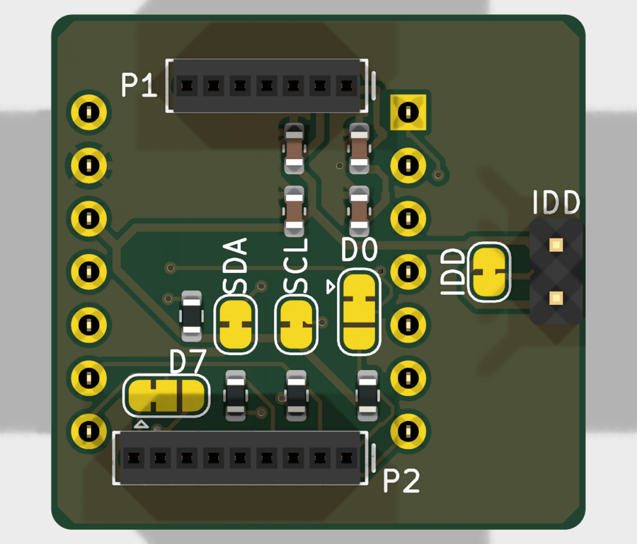
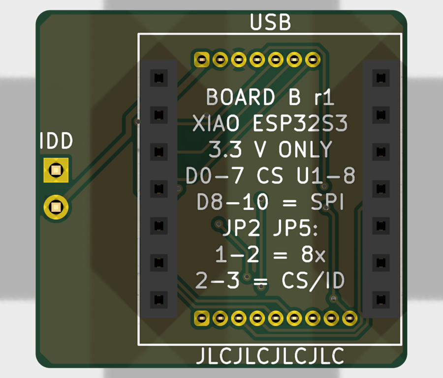

# Board B: XIAO ESP32-S3 shuttle carrier

A 25.5 x 24.6 mm sandwich. A **Bosch Shuttle Board 3.0** plugs in on top
(made for the BME690 8x shuttle, and switchable to single-sensor shuttles).
A **Seeed XIAO ESP32-S3** or **XIAO ESP32-S3 Sense** plugs in underneath,
its USB-C at the P1 end.

 

**3.3 V only.** The XIAO's 3V3 pin powers the shuttle; it supplies up to
700 mA, and eight BME690 heaters need about 100 mA.

## Pin map

| XIAO | ESP32-S3 | shuttle | BME690 8x shuttle |
|---|---|---|---|
| D0 | GPIO1 | P1-4 (via JP2) | sensor U1 chip select |
| D1 | GPIO2 | P1-5 | U2 chip select |
| D2 | GPIO3 | P1-6 | U3 chip select |
| D3 | GPIO4 | P1-7 | U4 chip select |
| D4 | GPIO5 | P2-5 | U5 chip select |
| D5 | GPIO6 | P2-6 | U6 chip select |
| D6 | GPIO43 | P2-7 | U7 chip select |
| D7 | GPIO44 | P2-8 (via JP5) | U8 chip select |
| D8 | GPIO7 | P2-2 SCK/SCL | SPI clock |
| D9 | GPIO8 | P2-3 SDO | SPI data from the sensors (MISO) |
| D10 | GPIO9 | P2-4 SDI/SDA | SPI data to the sensors (MOSI) |
| 3V3 | | P1-2 VDDIO, and P1-1 VDD via JP1 | power |
| GND | | P1-3 | ground |
| 5V | | not connected | |

Two things about these pins:

- **D6 (GPIO43)** is the ESP32-S3's UART TX. The chip prints its boot
  messages there for a moment at power-up. That's harmless as a chip
  select, because nothing clocks the bus yet, but the firmware has to use
  the USB port for its console. The XIAO does this anyway.
- **D2 (GPIO3)** is a strapping pin, but only if the JTAG eFuse is burned;
  on a normal XIAO it's an ordinary GPIO.

### XIAO ESP32-S3 Sense

The Sense's microSD card uses **D8-D10 (the same SPI bus) plus GPIO21**
for its chip select. On this board the card and the sensors share one SPI
bus, each with its own chip select. On the Sense, GPIO21 is also the
orange user LED.

Seeed's design files suggest a catch, though. The Sense's camera/SD
expansion board is the XIAO's full width and covers the edge where header
pins are soldered. If so, a Sense with headers can't have its expansion
board fitted. Check yours: fit the expansion board and see whether the
pin holes along both long edges stay clear. Without the expansion board, a
Sense works here like a plain XIAO: live data over USB and WiFi, no card.

## Selector jumpers

**JP2 (D0) and JP5 (D7)** are 3-pad jumpers, made with **pads 1-2
joined** for the BME690 8x shuttle. The joined pair is the one with the
copper bridge.

| jumper | 1-2 (as made) | 2-3 |
|---|---|---|
| JP2 | D0 to shuttle GPIO0: U1 chip select (8x) | D0 to shuttle **CS**, for single-sensor shuttles |
| JP5 | D7 to shuttle GPIO7: U8 chip select (8x) | D7 to **PROM_RW**, the shuttle's ID chip |

**For a single-sensor shuttle**, cut the bridge on both and solder pads
2-3 together. With JP2 set this way, CS has a 10k pull-up, so the shuttle
starts in I2C mode; drive D0 low before the first transfer for SPI. Either
way its SCK/SDI/SDO are on D8/D10/D9, and its INT1/INT2 (P1-6, P1-7) are
on D2/D3.

### Other jumpers

All of these are closed as made:

| jumper | label | open it to |
|---|---|---|
| JP1 | IDD | measure sensor current: put a meter across J3 |
| JP3 | SDA | remove the 4.7k SDA pull-up |
| JP4 | SCL | remove the 4.7k SCL pull-up |

VDDIO is wired straight to the XIAO's 3V3, because it must match the XIAO's
logic level. So unlike Board A there is no TIE jumper.

PROM_RW has a 1k pull-up (the DS28E05 datasheet requires 300-1500 ohm). Its
1-Wire timing is overdrive only; see `board_a/README.md`.

## Assembly

JLCPCB fits the eight 0603 parts on top. You solder the rest:

1. **XIAO sockets first,** on the **bottom** (the side with the XIAO
   outline and "USB"). Plug both 1x7 sockets onto the XIAO's headers and
   set the XIAO in place. That holds them straight and 15.24 mm apart.
   Tack one pin of each, check they're square, then solder the rest from
   the top side.
2. **Trim their pins flush** on the top side. The shuttle sits above them.
3. **Shuttle sockets** on the **top**. Hold them in place with the shuttle,
   as described in board A's README.
4. **J3** (optional), on top.
5. Check with a meter: 3V3 to GND is **not** a short.

Solder the XIAO's own pin headers with the long pins coming out of its
underside, the side without the USB connector, as usual. The XIAO then
plugs in with its USB-C at the P1 end, and its buttons and antenna jack
facing away from the board.

## Firmware

The logger firmware has a build for this board (from version 2.4), with the
same dashboard, AI-Studio files and features as the DevKitC version:

| how | what to do |
|---|---|
| browser | at [leakydata.github.io/bme690-toolkit](https://leakydata.github.io/bme690-toolkit/), click **Install for XIAO ESP32-S3 (Board B)**. If the port doesn't appear, hold the XIAO's B button while plugging it in |
| WiFi update | `bme690-logger-xiao-app.bin`, from the same page |
| from source | `idf.py -B build-xiao -DBME690_BOARD=xiao build` in `firmware/bme690-logger-idf` |

What's different on the XIAO:

- **A plain XIAO ESP32-S3 works too**, live only: the dashboard's live
  graphs, **Record here** (recording into your browser), and USB streaming
  to BME Studio or the `bme690` tool. With no card, the dashboard shows a
  note (not a warning) and the LED blinks normally. Card recording needs
  the Sense with its camera/SD board fitted.
- The serial console is the XIAO's USB-C.
- The orange LED blinks the status: long = recording, short = not
  recording, double = warning or problem. It stays off while a Sense card
  is mounted, because on the Sense the LED pin is the card's chip select.
- The Sense's card shares the sensor bus. The firmware switches every
  sensor to SPI mode before the card is touched, and locks the bus for
  each transfer, so the two never talk over each other.

**Not yet tested on hardware.** Both builds compile cleanly. The first
power-up should be checked on the dashboard's Health tab.

## Ordering at JLCPCB

Everything is in `fab/`, in the same format as Board A:

| file | upload as |
|---|---|
| `board_b-gerbers.zip` | the PCB |
| `board_b-bom-jlcpcb.csv` | PCB Assembly: BOM |
| `board_b-cpl-jlcpcb.csv` | PCB Assembly: CPL |

The options, coupon notes and pre-order checklist are the same as in
`board_a/README.md`, with these differences:

| check | Board B |
|---|---|
| board size | 25.5 x 24.6 mm |
| holes | 42 (10 vias, 16 shuttle socket holes, 16 header holes) |
| assembly | Economic, top side |
| SMD parts | the same eight Basic parts as Board A |

### Parts JLCPCB fits

| parts | value | LCSC |
|---|---|---|
| R1, R2 | 4.7k 0603 | C23162 |
| R3 | 1k 0603 | C21190 |
| R4 | 10k 0603 | C25804 |
| C1, C3 | 100 nF 0603 | C14663 |
| C2, C4 | 10 uF 0603 | C19702 |

All are Basic; stock was checked 2026-10-05.

### Parts you buy

Per board:

| part | qty | about |
|---|---|---|
| Sullins LPPB071NFFN-RC, 7-pin 1.27 mm socket | 1 | $1.00 |
| Sullins LPPB091NFFN-RC, 9-pin 1.27 mm socket | 1 | $1.20 |
| Sullins PPTC071LFBN-RC, 1x7 female 2.54 mm, 8.5 mm tall | 2 | $0.70 each |
| 1x2 male header, 2.54 mm (optional, for IDD) | 1 | $0.05 |
| Seeed XIAO ESP32-S3 (or the Sense) | 1 | see seeedstudio.com |

## Cost estimate, 5 boards

The same as Board A, since it uses the same eight parts on a board under
100 x 100 mm:

| order | before shipping | with shipping and duty |
|---|---|---|
| bare PCBs | about $3-4 | about $7-10 by the cheapest shipping |
| PCB + Economic assembly | about $13-15 | about $17-22 |

**Ordering A and B together:** two designs are two PCB line items. The
assembly setup and stencil fees ($8.18 + $1.53) are charged per design,
but you pay shipping once.

## Design rules

The same JLCPCB rules as Board A. Results: ERC 0, DRC 0 (warnings
included), schematic parity 0.

The XIAO footprint's courtyard covers its two sockets only. The module
itself rides 8.5 mm up on them, well above the shuttle socket's 3 mm pin
tails that pass beneath it. DRC therefore doesn't flag those tails.

## Editing

Open `board_b.kicad_pro` in KiCad 10. `build.py` and `pcb.py` generated
the first version. Edit in KiCad from here on; re-running the scripts
overwrites your changes.
