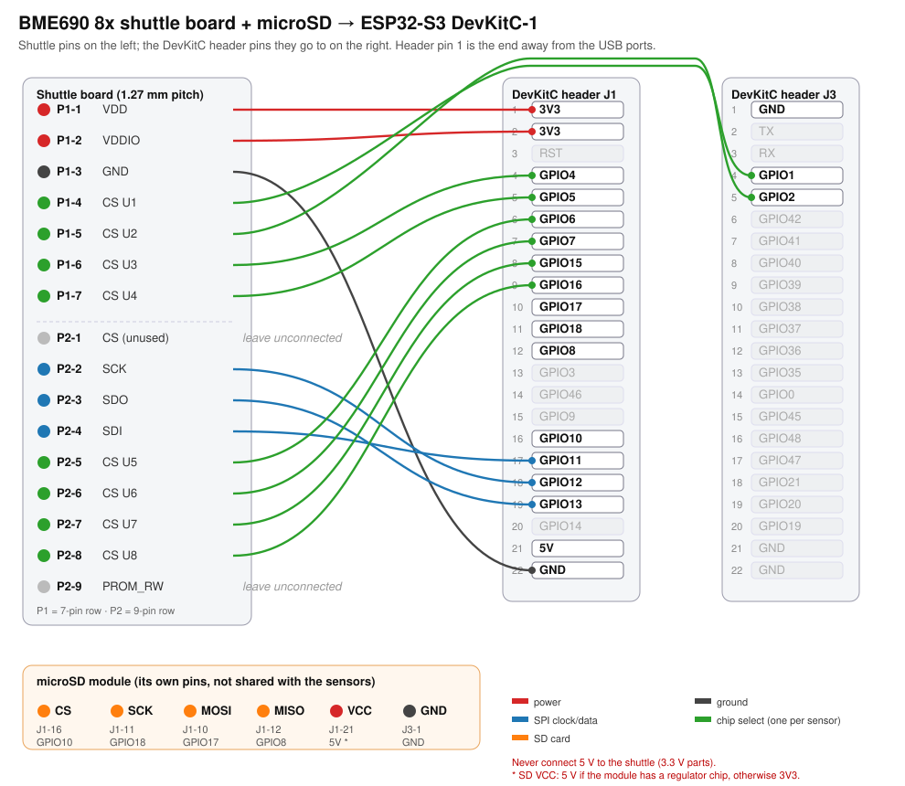

# Wiring: BME690 8x shuttle board and microSD to an ESP32-S3 DevKitC-1

Sixteen wires for the sensors, six for the SD card. The shuttle's pins are 1.27 mm apart, so use a 1.27 → 2.54 mm
adapter or 1.27 mm female headers. Keep wires under 20 cm.

**Never connect 5 V to the shuttle.** The sensors are 3.3 V parts.

## Which row is which

- **P1** is the shuttle's 7-pin row, **P2** its 9-pin row. Pin 1 of each row is marked on the board.
- On the DevKitC-1, header **J1** runs down one side and **J3** down the other. Pin 1 of each header is the end
  **away from the USB ports**. All the connections are on J1 except GPIO1, GPIO2 and one ground on J3.

## Shuttle board

| shuttle pin | signal | ESP32-S3 | DevKitC header pin |
|---|---|---|---|
| P1-1 | VDD (sensor power) | 3V3 | J1-1 |
| P1-2 | VDDIO (logic power) | 3V3 | J1-2 |
| P1-3 | GND | GND | J1-22 |
| P1-4 | chip select, sensor 0 (U1) | GPIO1 | J3-4 |
| P1-5 | chip select, sensor 1 (U2) | GPIO2 | J3-5 |
| P1-6 | chip select, sensor 2 (U3) | GPIO4 | J1-4 |
| P1-7 | chip select, sensor 3 (U4) | GPIO5 | J1-5 |
| P2-1 | CS: not used on the 8x board | leave unconnected | |
| P2-2 | SCK (clock) | GPIO12 | J1-18 |
| P2-3 | SDO (data from the sensors) | GPIO13 | J1-19 |
| P2-4 | SDI (data to the sensors) | GPIO11 | J1-17 |
| P2-5 | chip select, sensor 4 (U5) | GPIO6 | J1-6 |
| P2-6 | chip select, sensor 5 (U6) | GPIO7 | J1-7 |
| P2-7 | chip select, sensor 6 (U7) | GPIO15 | J1-8 |
| P2-8 | chip select, sensor 7 (U8) | GPIO16 | J1-9 |
| P2-9 | PROM_RW: the shuttle's ID chip | leave unconnected | |

Sensor *N* in the firmware, the dashboard and recordings is part U(*N*+1) on the shuttle. The mapping follows
Bosch's schematic: each sensor's CSB pin is wired to one of the Application Board's GPIO0–7 lines, which come out
on P1-4…7 and P2-5…8.

## microSD module

The card gets **its own four GPIOs**. Many cheap SD modules have a level-shifter chip that keeps driving its data
line even when the card isn't selected, which would corrupt every sensor reading if the two shared a bus.

| SD module | ESP32-S3 | DevKitC header pin |
|---|---|---|
| CS | GPIO10 | J1-16 |
| SCK / CLK | GPIO18 | J1-11 |
| MOSI / DI | GPIO17 | J1-10 |
| MISO / DO | GPIO8 | J1-12 |
| VCC | 5V **if the module has a regulator** (a small 3-pin chip, usually AMS1117), otherwise 3V3 | J1-21 (5V) or J1-1/2 (3V3) |
| GND | GND | J3-1 (or any GND) |

Format the card as FAT32. The logger works without a card; readings then stream only to the dashboard and USB.

## Board extras

| | ESP32-S3 | notes |
|---|---|---|
| BOOT button | GPIO0 | short press: next sample label; hold 2 s: start/stop recording |
| RGB status LED | GPIO48 (DevKitC-1 v1.0) or GPIO38 (v1.1) | the firmware drives both |
| USB serial | the port labelled **UART** (CH340/CP210x) | the port labelled **USB** also works |

## Start small, then check

1. Wire power, ground, the three SPI lines and **one** chip select (P1-4 → GPIO1). Seven wires are enough to prove
   the shuttle is alive.
2. Open the dashboard (join WiFi **BME690-XXXX**, go to http://192.168.4.1). The **Health** tab says which sensors
   answer and which wire to check for any that don't.
3. Add the other chip selects, pressing **Re-check sensors** after each.
4. When all eight answer, check every wire against the table above once more, then press **Remember these chips** on
   the Health tab's **Wiring check** card.

### How the wiring check works

Every BME690 carries its own factory calibration, and one value of it (`par_t1`) works like a serial number. Once
you press **Remember these chips**, the board stores which chip belongs in each slot. At every start, and on
**Re-check sensors**, it compares them again and says in plain English when two chip-select wires are swapped, e.g.
*"The wires for U1 and U2 are swapped … Put shuttle P1-4 on GPIO1 and P1-5 on GPIO2."*

Only press **Remember** after checking the wiring by hand. The board treats whatever it remembers as correct. Over
USB serial the same commands are `chips remember` and `chips forget`.
